# Bike Sharing Analysis in Capital Bikeshare System

## Introduction
Bike-sharing systems offer a modern twist on traditional bike rentals, automating the membership, rental, and return processes. With over 500 schemes globally, these systems are gaining attention for their potential in addressing traffic, environmental, and health issues. The data generated by these systems provides unique insights into urban mobility, transforming bike sharing into a virtual sensor network for city dynamics.

## Overview
This project analyzes bike-sharing activities in the Capital Bikeshare system of Washington D.C., USA, for the years 2011 and 2012. We aim to understand how environmental factors and seasonal variations influence bike rental patterns. The analysis is based on a dataset that includes detailed records of bike rentals along with weather and seasonal information, allowing us to visualize key trends and inform strategic decisions for maximizing the system's profitability.

## Data Description
The dataset comprises 17,389 records of hourly and daily bike rental counts along with corresponding weather and seasonal information. Key variables include:
- **Date and Time**: Hourly and daily timestamps.
- **Weather Conditions**: Including temperature, humidity, and wind speed.
- **Rental Counts**: Separate counts for casual and registered users.

## Design Methodology
We processed the `hour.csv` dataset for a granular analysis, encoding categorical variables for better visualization and decoding them back for interpretability. This approach facilitated an in-depth understanding of how various factors impact rental behaviors.

## Visualizations
The analysis is illustrated through a series of Tableau visualizations, each providing insights into different aspects of bike rental trends.

### Screenshots Folder
- **Area Plot of Casual vs Registered Across Months and Years**
  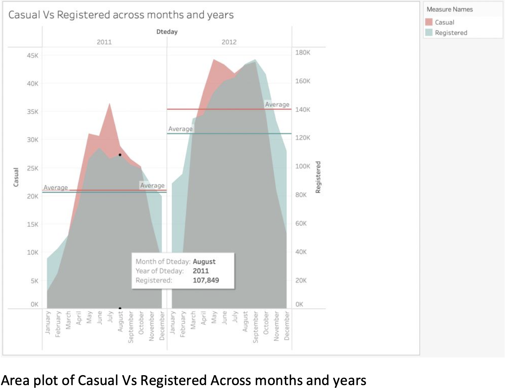
  *Highlights the variation in casual and registered user rentals over time.*

- **Area Plot of Number of Users Across Temp and ATemp**
  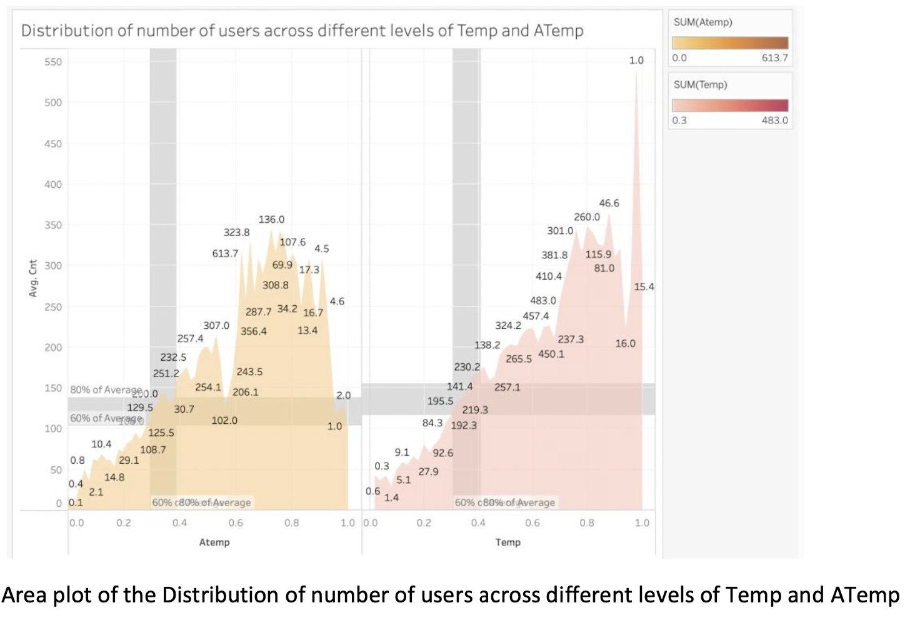
  *Shows how temperature and 'feels like' temperature affect user activity.*

- **Average Number of Users by Windspeed, Humidity, Temperature**
  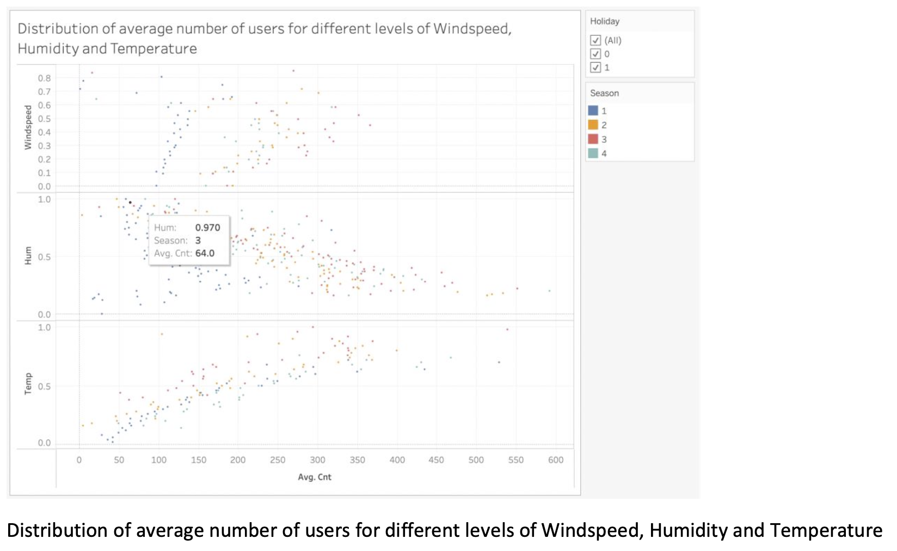
  *Illustrates the relationship between bike rentals and environmental conditions.*

- **Bar Plot for the Number of Rental Bikes vs DateDay**
  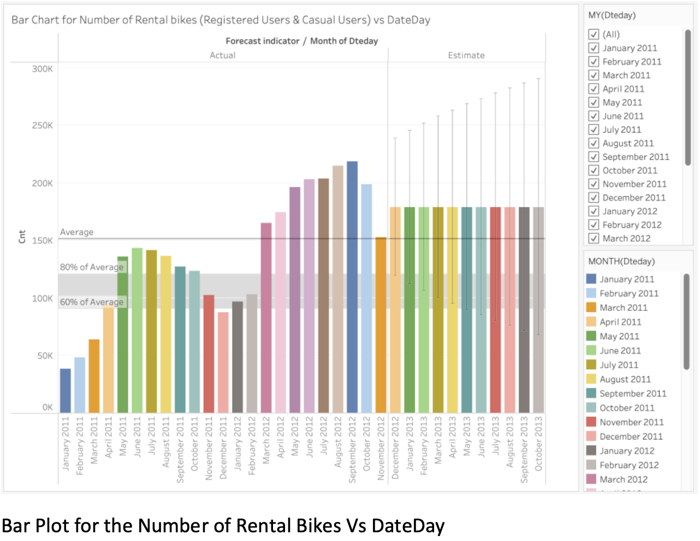
  *Displays daily rental bike counts.*

- **Bar Plot for Number of Users on Working and Non-Working Days**
  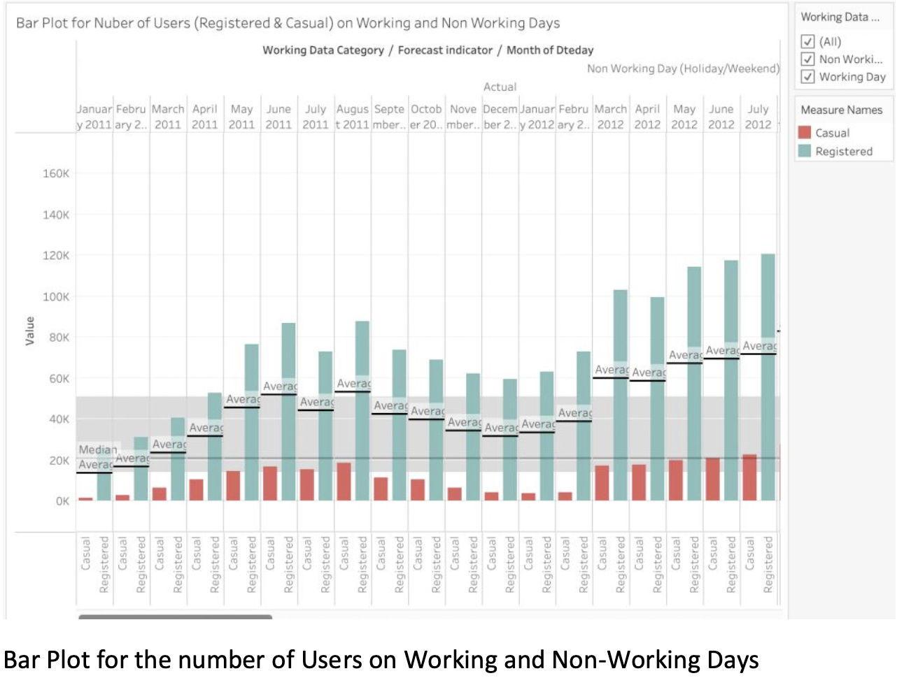
  *Compares bike usage on working days to non-working days.*

- **Boxplot of Casual vs Registered Users Across Seasons**
  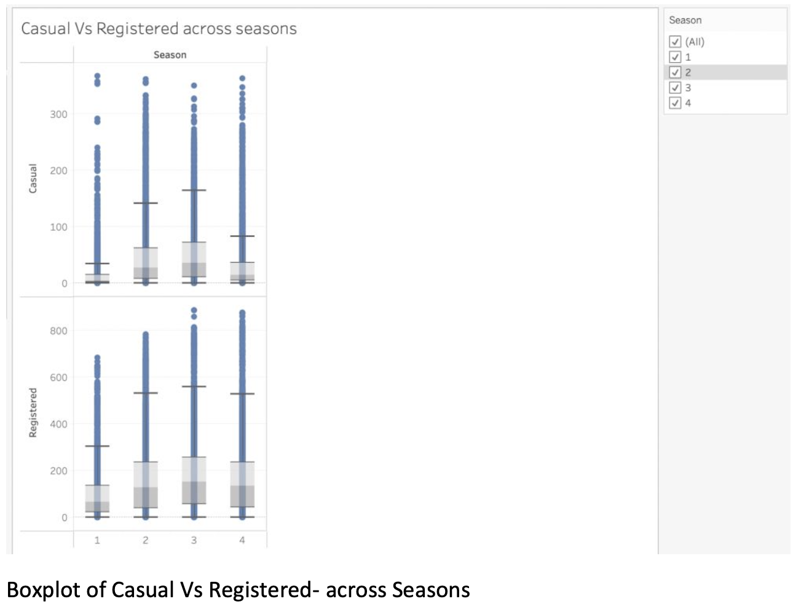
  *Seasonal comparison of casual and registered user rentals.*

- **Bubble Plot of Count of Users in Days of a Week**
  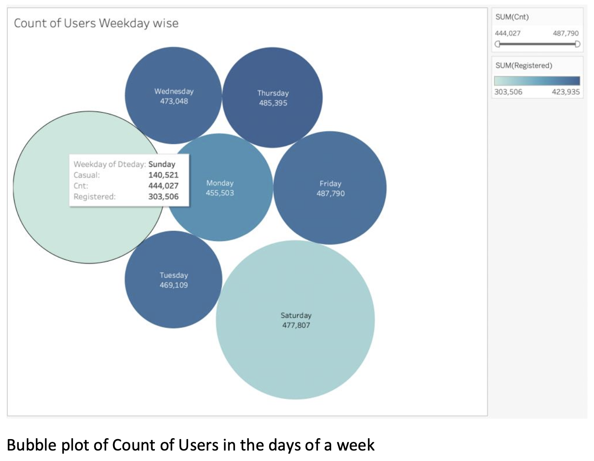
  *Visualizes the distribution of users across the week.*

- **Dot Plot of Casual vs Registered Users Across Hours and Years**
  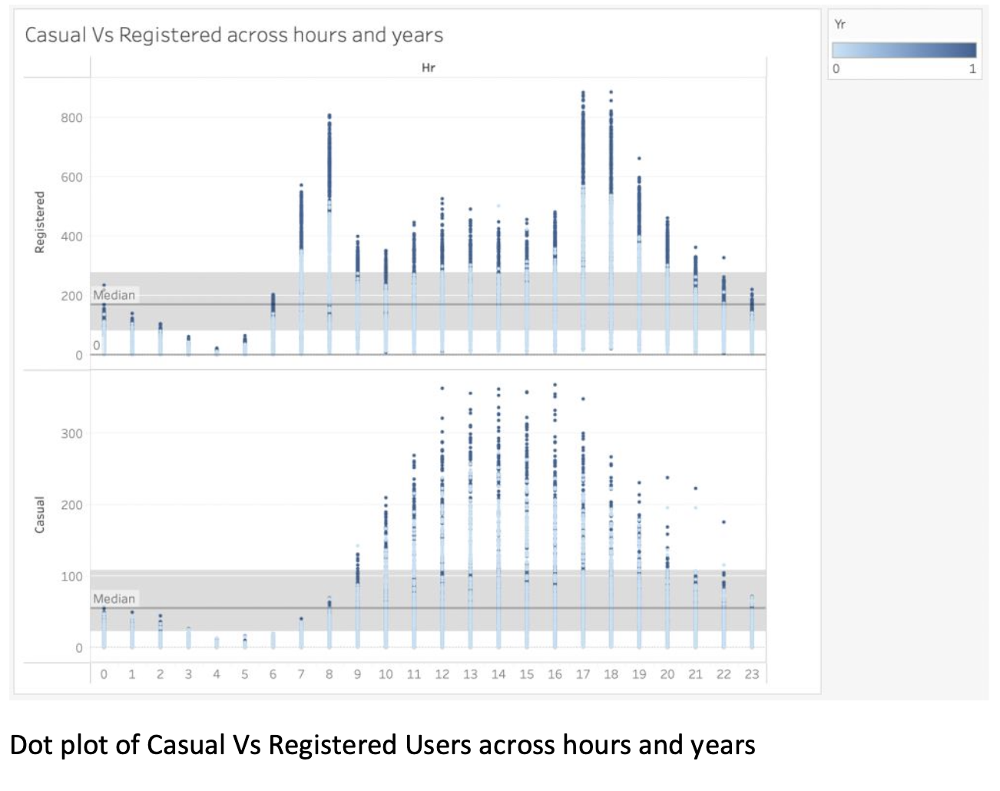
  *Explores hourly and yearly trends in user type.*

- **Heatmap of Registered Users Across Each Day of the Week and Season**
  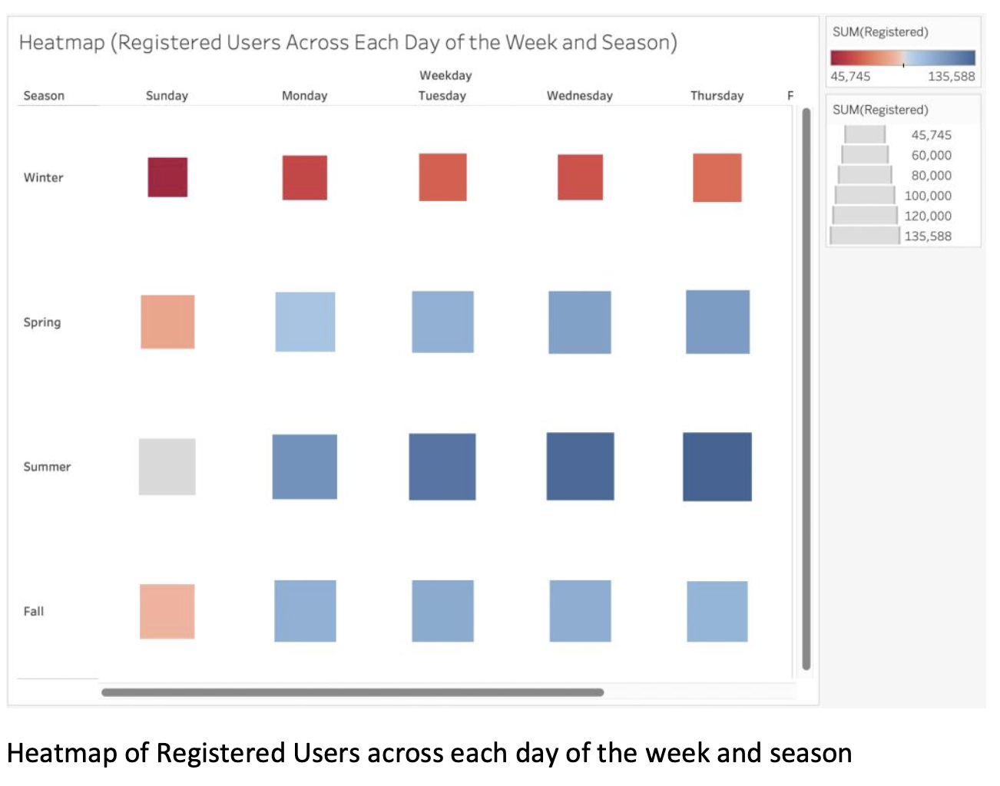
  *Analyzes patterns of registered users by day and season.*

- **Line Plot of Number of Users Across Months and Years**
  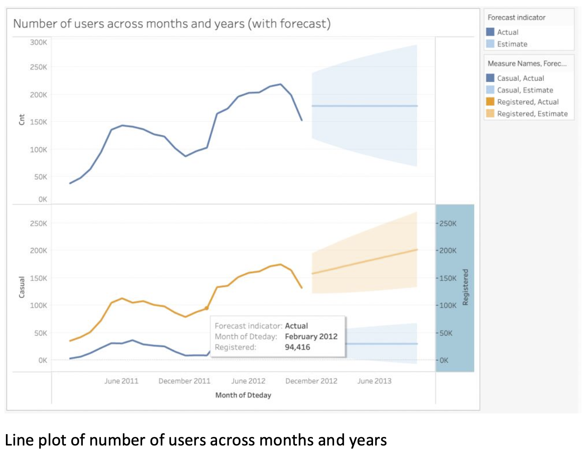
  *Trends in bike usage over months and years.*

- **Stacked Barplot of Casual and Registered Users Based on Seasons**
  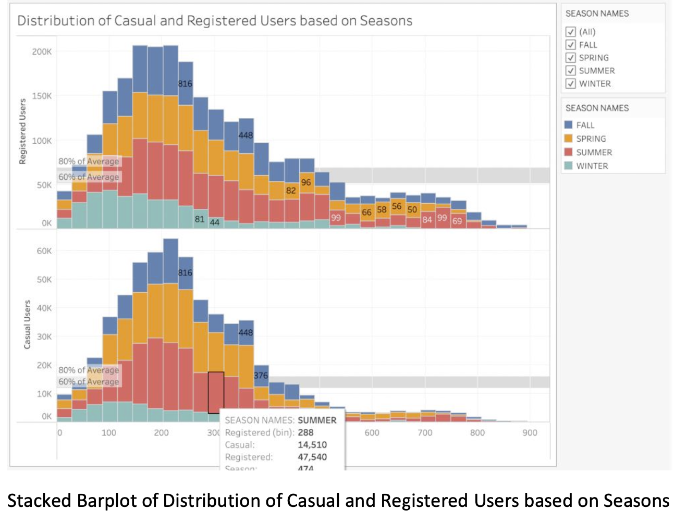
  *Delineates seasonal effects on user type.*

- **Stacked Barplot of Casual and Registered Users Based on Weather**
  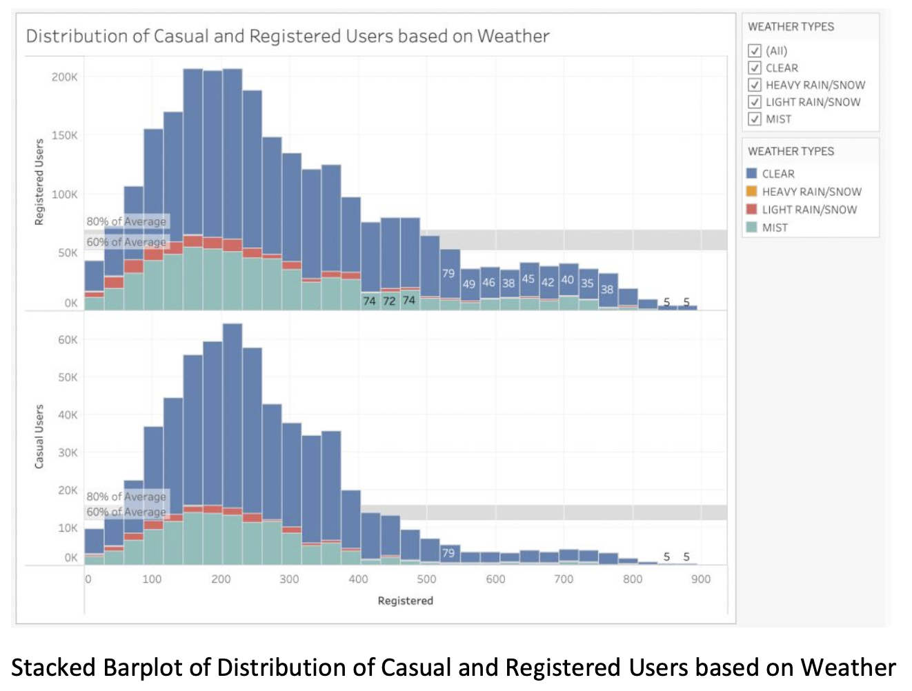
  *Weather influence on casual versus registered users.*

- **Treemap of Number of Users in Hour Range**
  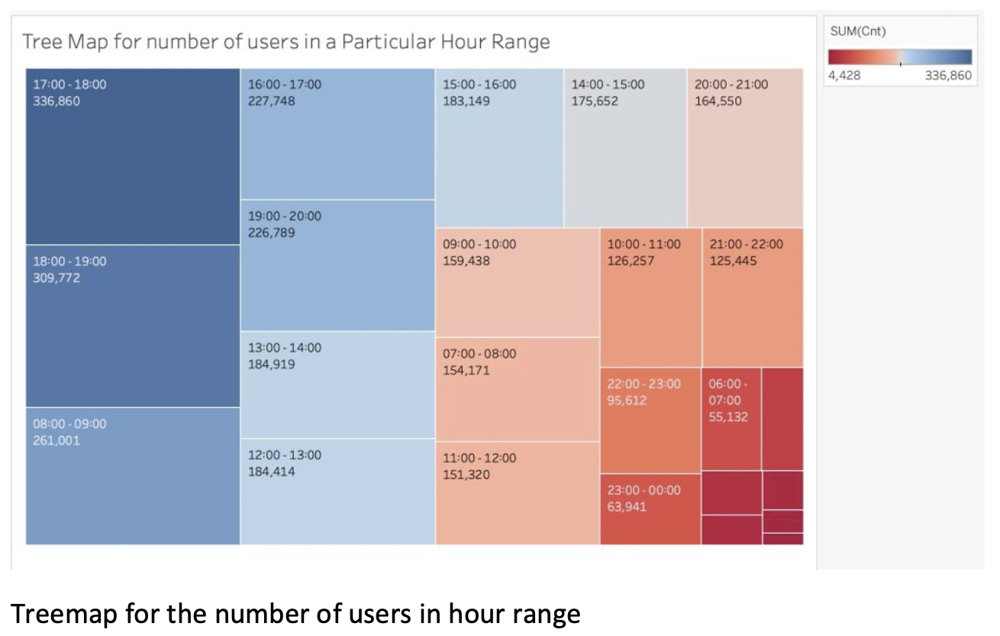
  *Hourly distribution of users visualized in a treemap.*

### UI Snaps Folder
- **Count of Bikes per Month Bar Plot**
  
  *Monthly bike rental count.*

- **Count of Users (Working and Non-Working Day) Bar Plot**
  _Bar_Plot.png)
  *Comparison of user counts on working versus non-working days.*

## Conclusion
Our analysis reveals that seasonal and weather conditions significantly influence bike rental patterns. Strategic insights, such as the higher demand in warmer seasons and specific hours, can help optimize bike availability. The analysis also highlights the importance of bikes as a sustainable mode of transport, benefiting both users and providers by enhancing accessibility and encouraging healthy lifestyles.

This comprehensive suite of visualizations offers a deep dive into the dynamics of bike sharing in Washington D.C., providing actionable insights for system improvements and sustainability efforts.
